<div align="center">
  
</div>

<br />

## 🕹️ Player Info

| STAT | VALUE |
| :-- | :-- |
| **Player** | BOINRED |
| **Class** | Game Server Programmer → Founder → CTO |
| **EXP** | 2008년부터 적립 중 |
| **Current Quest** | 🔭 다양한 프로젝트를 개발하고 있습니다 |
| **Passive Skill** | 🌱 새로운 기술을 배우고 성장하는 것을 좋아합니다 |

## 📜 Quest Log

```diff
@@ 2024 ~ 2026 · 더블미 @@
+ CTO                     노예는 아니지만 멋진 슬레이브

@@ 2018 ~ 2024 · 게임그레스 @@
+ CEO & TD                인생 첫 창업!

@@ 2011 ~ 2017 · 엔씨소프트 @@
+ Game Server Programmer  리니지M 게임 서버 개발
+ Game Server Programmer  리니지1 게임 서버 개발

@@ 2008 ~ 2010 · 나우콤 @@
+ Game Server Programmer  포트파이어 게임 서버 개발
```

## 🎒 Inventory



## 📊 Server Monitor

<p align="center">
  
  
</p>

## 🤝 Party Invite

<p align="center">
  <a href="https://github.com/boinred">
    
  </a>
</p>

<p align="center"><sub><code>Connection closed by remote host. GG! 🎮</code></sub></p>
